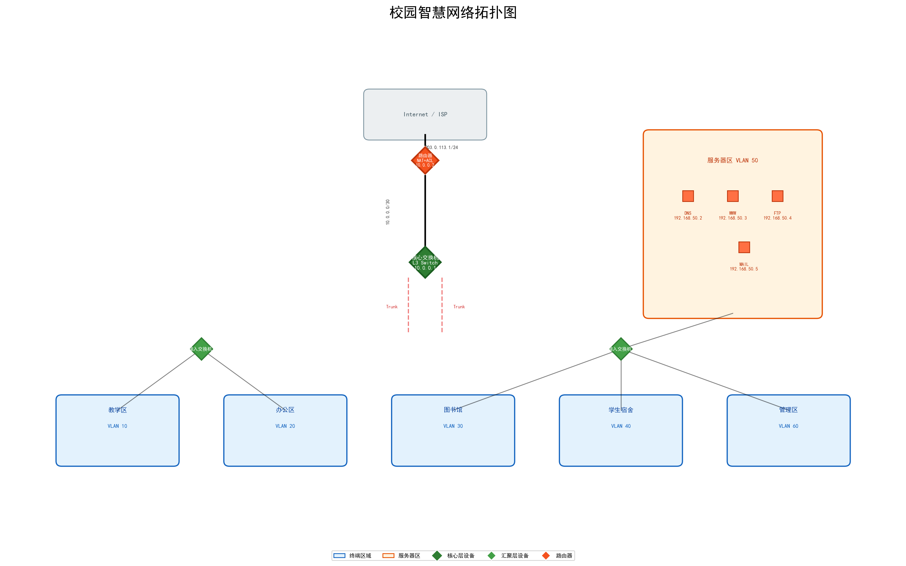

# 计算机网络课程设计报告

---

## 摘要

本课程设计围绕计算机网络核心知识体系，完成了两项实践任务：（1）基于三层架构的校园中小型网络工程设计与实现；（2）基于Socket编程的局域网即时聊天软件开发。网络设计部分采用VLAN划分、DHCP自动分配、OSPF/静态路由、ACL访问控制和NAT技术，构建了覆盖教学区、办公区、图书馆、学生宿舍、服务器区和管理区的智慧校园网络；聊天软件部分基于Python Socket和tkinter，实现了用户注册登录、公聊广播、私聊定向和在线用户管理功能。通过两个项目的实践，加深了对TCP/IP协议栈、VLAN隔离、路由交换、Socket编程以及C/S架构的理解。

**关键词**：网络工程；VLAN；ACL；NAT；Socket编程；即时通信；C/S架构

---

## 第一章 项目背景与意义

### 1.1 项目背景

随着信息技术的飞速发展，计算机网络已成为现代信息社会的基础设施。高校作为知识传播和创新的重要场所，对网络基础设施提出了更高的要求——不仅要满足日常教学、办公和科研需求，还需支撑智慧校园的各类数字化应用。

计算机网络课程是计算机相关专业的核心课程，课程设计是培养学生实践能力的重要环节。本课程设计通过两个实战项目——网络工程设计与网络应用程序开发，使学生能够将课堂所学的TCP/IP协议、路由交换、网络安全、Socket编程等理论知识应用于实际场景，锻炼综合运用能力。

### 1.2 项目意义

1. **网络工程方面**：通过规划校园网络拓扑、划分VLAN、配置路由交换设备，使学生掌握企业级网络的设计方法和配置技能，理解分层网络架构的设计理念，熟悉Cisco IOS的基本配置命令。

2. **应用开发方面**：通过开发基于Socket的局域网聊天软件，使学生深入理解TCP协议的工作机制、客户端-服务器模型、多线程并发处理以及GUI编程，为今后开发网络应用打下基础。

3. **综合能力**：通过撰写课程设计报告，锻炼学生的文档写作能力、图表绘制能力和系统化思考能力。

---

## 第二章 中小型网络工程设计与实现

### 2.1 需求分析

#### 2.1.1 场景描述

本项目以某大学智慧校园网络为背景，校园包含教学区、办公区、图书馆、学生宿舍、服务器区和管理区六大功能区域，要求设计并实现一个安全、高效、可扩展的园区网络。

#### 2.1.2 功能需求

1. **网络隔离**：不同区域通过VLAN实现二层隔离，确保各区域数据独立、安全
2. **VLAN间通信**：通过三层交换机实现VLAN间路由，使不同区域可按需通信
3. **IP地址自动分配**：各区域终端通过DHCP自动获取IP地址，简化运维管理
4. **服务器部署**：在服务器区部署DNS、WWW、FTP、MAIL四大基础服务
5. **网络安全**：通过ACL实现访问控制，防止未授权访问
6. **外网访问**：通过NAT实现内网终端访问Internet，同时对外发布Web、FTP等服务

#### 2.1.3 性能需求

- 核心层支持千兆交换，保证高带宽低延迟
- DHCP响应时间 < 2秒
- VLAN间路由延迟 < 5ms
- 网络可用性 ≥ 99.5%

### 2.2 概要设计

#### 2.2.1 网络拓扑设计

本设计采用经典的三层网络架构模型——核心层、汇聚层、接入层，各层职责分明：

- **核心层**：1台三层交换机（Cisco 3560），提供高速交换、VLAN间路由和DHCP服务
- **汇聚层**：2台二层交换机（Cisco 2960），汇聚各区域接入设备并通过Trunk上联核心层
- **接入层**：接入交换机端口，连接终端PC和服务器
- **出口路由器**：连接外网ISP，提供NAT转换和ACL访问控制

拓扑图如下：



**图2-1 校园智慧网络拓扑图**

#### 2.2.2 VLAN与子网规划

按照功能区域进行VLAN划分，每个VLAN对应一个独立的IP子网，实现广播隔离和逻辑分组：

| VLAN ID | 名称     | 子网              | 网关          | 终端数量 | 用途           |
|---------|---------|-------------------|---------------|---------|---------------|
| 10      | 教学区   | 192.168.10.0/24   | 192.168.10.1  | ~200    | 教室和机房      |
| 20      | 办公区   | 192.168.20.0/24   | 192.168.20.1  | ~150    | 行政办公室      |
| 30      | 图书馆   | 192.168.30.0/24   | 192.168.30.1  | ~100    | 电子阅览室      |
| 40      | 学生宿舍 | 192.168.40.0/24   | 192.168.40.1  | ~200    | 学生宿舍网络    |
| 50      | 服务器区 | 192.168.50.0/24   | 192.168.50.1  | ~10     | 服务器集群      |
| 60      | 管理区   | 192.168.60.0/24   | 192.168.60.1  | ~20     | 网络管理        |

选择 `/24` 子网掩码的原因：每个VLAN最多可容纳254个终端，足以满足各区域需求，且子网计算简单、便于管理。

#### 2.2.3 服务器部署规划

| 服务     | IP地址         | 端口 | 说明                     |
|---------|---------------|------|-------------------------|
| DNS Server  | 192.168.50.2  | 53   | 域名解析服务               |
| WWW Server  | 192.168.50.3  | 80   | 学校官网                   |
| FTP Server  | 192.168.50.4  | 21   | 文件存储与共享              |
| MAIL Server | 192.168.50.5  | 25   | 校内邮件系统                |

服务器使用静态IP地址，DHCP地址池中排除192.168.50.2~192.168.50.5，防止冲突。

#### 2.2.4 IP地址规划

- **内网私有地址**：192.168.0.0/16
- **核心-路由器互联**：10.0.0.0/30（核心交换机: 10.0.0.1, 路由器: 10.0.0.2）
- **公网地址**：203.0.113.1/24（路由器外网接口，示例地址）

#### 2.2.5 安全策略设计

1. **访问控制列表（ACL）**：
   - 在外网接口入方向应用ACL 101
   - 允许已建立连接的返回流量
   - 允许外网访问服务器的特定端口（WWW:80, FTP:20-21, MAIL:25）
   - 拒绝其他所有从外网主动发起的连接

2. **NAT地址转换**：
   - 内网终端通过PAT共享公网IP访问Internet
   - 服务器通过静态NAT对外发布服务

3. **设备安全**：
   - Telnet/VTY密码保护
   - Enable密码加密
   - 服务密码加密（service password-encryption）

### 2.3 详细设计

#### 2.3.1 核心交换机配置

核心交换机是整个网络的中枢，承担VLAN管理、VLAN间路由和DHCP服务的职责。以下为关键配置项：

**（1）VLAN创建**

```
vlan 10
 name Jiaoxue
vlan 20
 name Bangong
...
```

**（2）SVI接口配置（各VLAN网关）**

```
interface vlan 10
 ip address 192.168.10.1 255.255.255.0
 no shutdown
...
```

**（3）Trunk链路配置**

上联汇聚层交换机的接口配置为Trunk模式，允许所有VLAN通过：

```
interface GigabitEthernet0/1
 switchport mode trunk
```

**（4）DHCP服务配置**

为每个VLAN创建独立的DHCP地址池，排除网关和服务器IP：

```
ip dhcp pool VLAN10_Jiaoxue
 network 192.168.10.0 255.255.255.0
 default-router 192.168.10.1
 dns-server 192.168.50.2
```

**（5）路由配置**

启用IP路由功能，并添加默认路由指向出口路由器：

```
ip routing
ip route 0.0.0.0 0.0.0.0 10.0.0.2
```

完整的核心交换机配置文件见 `network-design/configs/core-switch.conf`。

#### 2.3.2 接入交换机配置

接入交换机主要负责终端设备的接入，配置相对简单：

- 创建对应的VLAN
- 上行接口配置为Trunk模式
- 接入接口配置为Access模式，绑定到指定VLAN
- 开启PortFast以加速终端接入

完整的接入交换机配置文件见 `network-design/configs/access-switch1.conf` 和 `access-switch2.conf`。

#### 2.3.3 出口路由器配置

出口路由器承担内网与外网之间的流量控制和安全防护职责：

**（1）接口IP与NAT配置**

```
interface GigabitEthernet0/0
 ip address 10.0.0.2 255.255.255.252
 ip nat inside

interface GigabitEthernet0/1
 ip address 203.0.113.1 255.255.255.0
 ip nat outside

ip nat inside source list 10 interface GigabitEthernet0/1 overload
```

**（2）静态路由**

```
ip route 192.168.10.0 255.255.255.0 10.0.0.1
...
ip route 0.0.0.0 0.0.0.0 203.0.113.254
```

**（3）ACL访问控制**

```
access-list 101 permit tcp any any established
access-list 101 permit tcp any host 203.0.113.1 eq 80
access-list 101 deny ip any any

interface GigabitEthernet0/1
 ip access-group 101 in
```

完整配置文件见 `network-design/configs/router.conf`。

### 2.4 调试分析

#### 2.4.1 测试方案

在Packet Tracer中搭建完整拓扑后，按以下步骤进行测试：

1. **连通性测试**：各VLAN内PC之间互ping，验证二层通信正常
2. **跨VLAN通信测试**：不同VLAN的PC之间互ping，验证三层路由正常
3. **DHCP测试**：PC设为自动获取IP，查看是否获取到对应VLAN的IP地址
4. **外网访问测试**：内网PC访问Internet（模拟外网服务器），验证NAT工作正常
5. **ACL测试**：从外网尝试主动连接内网PC，验证ACL阻止未授权访问
6. **服务器访问测试**：从外网访问Web/FTP服务器，验证静态NAT映射生效

#### 2.4.2 预期结果

| 测试项目             | 预期结果                         |
|---------------------|---------------------------------|
| 同VLAN PC互ping      | 通（二层可达）                     |
| 不同VLAN PC互ping    | 通（经核心交换机SVI路由）            |
| DHCP获取IP           | 成功获取对应子网IP                  |
| 内网访问外网          | 通（PAT转换生效）                  |
| 外网主动访问内网PC    | 不通（ACL拒绝）                    |
| 外网访问Web服务器     | 通（静态NAT映射）                  |
| 外网主动访问FTP      | 通（静态NAT映射）                  |

> 注：实际测试截图需在Packet Tracer中完成并添加到报告 `report/images/` 目录。

---

## 第三章 基于Socket的局域网聊天软件设计与实现

### 3.1 需求分析

#### 3.1.1 功能需求

| 编号 | 功能 | 描述 |
|------|------|------|
| F1 | 用户注册 | 新用户设置用户名和密码完成注册，信息持久化存储 |
| F2 | 用户登录 | 已注册用户通过用户名和密码验证身份后登录 |
| F3 | 公聊广播 | 用户发送消息，所有在线用户均可收到 |
| F4 | 私聊定向 | 用户通过`@用户名 消息`格式向指定用户发送私聊消息 |
| F5 | 在线用户列表 | 实时显示当前在线用户 |
| F6 | 上下线通知 | 用户登录/退出时，广播上线/离线通知 |
| F7 | 图形化界面 | 提供友好的GUI操作界面 |

#### 3.1.2 非功能需求

- **并发性**：服务端支持多客户端同时在线（使用多线程）
- **可靠性**：连接断开时客户端可感知并提示
- **易用性**：GUI界面直观，操作简单
- **可维护性**：代码模块化，功能清晰分离

#### 3.1.3 技术选型

| 技术 | 用途 | 说明 |
|------|------|------|
| Python 3 | 开发语言 | 跨平台、开发效率高 |
| socket | 网络通信 | Python标准库，提供TCP连接 |
| threading | 多线程 | 支持多客户端并发处理 |
| tkinter | GUI框架 | Python标准库，跨平台GUI |
| json | 数据格式 | 消息序列化格式 |

### 3.2 概要设计

#### 3.2.1 系统架构

系统采用经典的客户端-服务器（C/S）架构：

```
┌──────────────┐     ┌──────────────┐     ┌──────────────┐
│  Client 1    │     │  Server      │     │  Client N    │
│ (tkinter GUI)│────▶│ (多线程)      │◀────│ (tkinter GUI)│
└──────────────┘     │              │     └──────────────┘
                     │ ┌──────────┐ │
                     │ │用户数据   │ │
                     │ │users.json│ │
                     │ └──────────┘ │
                     └──────────────┘
```

#### 3.2.2 通信协议设计

采用自定义协议，基于TCP传输，消息体为JSON格式：

| 消息类型 | 方向 | 格式 | 说明 |
|---------|------|------|------|
| register | C→S | `{"type":"register","username":"xxx","password":"xxx"}` | 用户注册 |
| login | C→S | `{"type":"login","username":"xxx","password":"xxx"}` | 用户登录 |
| broadcast | C→S | `{"type":"broadcast","content":"hello"}` | 发送公聊消息 |
| private | C→S | `{"type":"private","target":"user2","content":"hi"}` | 发送私聊消息 |
| get_users | C→S | `{"type":"get_users"}` | 请求在线用户列表 |
| response | S→C | `{"type":"response","status":"ok/error","message":"..."}` | 服务端响应 |
| system | S→C | `{"type":"broadcast","content":"...","sender":"[系统]"}` | 系统广播 |

#### 3.2.3 数据结构

**用户数据（users.json）**：
```json
{
  "alice": "password123",
  "bob": "password456"
}
```

**在线用户表（服务端内存）**：
```python
{
  "username": {
    "password": "xxx",
    "addr": ("127.0.0.1", 12345),  # 客户端地址
    "socket": <socket object>       # TCP socket引用
  }
}
```

### 3.3 详细设计

#### 3.3.1 类图

```
┌─────────────────────────────────┐
│          ChatServer             │
├─────────────────────────────────┤
│ - host: str                     │
│ - port: int                     │
│ - server_socket: socket         │
│ - clients: dict                 │
│ - lock: threading.Lock          │
├─────────────────────────────────┤
│ + start()                       │
│ + handle_client(sock, addr)     │
│ + broadcast(content, ...)       │
│ + private_message(target, ...)  │
│ - _handle_register(msg, sock)   │
│ - _handle_login(msg, sock)      │
│ - _handle_broadcast(msg, ...)   │
│ - _handle_private(msg, ...)     │
│ - _handle_get_users(sock)       │
│ - _load_users()                 │
│ - _save_users()                 │
└─────────────────────────────────┘

┌─────────────────────────────────┐
│         LoginWindow             │
├─────────────────────────────────┤
│ - root: tk.Tk                   │
│ - socket: socket                │
│ - username: str                 │
├─────────────────────────────────┤
│ + run() : LoginWindow           │
│ + connect() : bool              │
│ + do_login()                    │
│ + do_register()                 │
│ + send_and_recv(msg) : dict     │
└─────────────────────────────────┘

┌─────────────────────────────────┐
│         ChatWindow              │
├─────────────────────────────────┤
│ - root: tk.Tk                   │
│ - socket: socket                │
│ - username: str                 │
│ - running: bool                 │
│ - chat_display: ScrolledText    │
│ - user_listbox: Listbox         │
├─────────────────────────────────┤
│ + run()                         │
│ + receive_loop()                │
│ + send_message(event)           │
│ + refresh_users()               │
│ + append_text(text, tag)        │
│ - _handle_message(msg)          │
└─────────────────────────────────┘
```

#### 3.3.2 关键流程

**（1）用户登录流程**

```
客户端                    服务端
  │                         │
  │ ── login ──────────────▶│
  │                         │ 验证用户名/密码
  │ ◀── response(ok/err) ──│
  │                         │ 广播上线通知
  │ ◀── broadcast(系统) ───│
  │                         │
```

**（2）公聊消息流程**

```
客户端A                   服务端                  客户端B, C, D...
  │                         │                         │
  │ ── broadcast ─────────▶│                         │
  │                         │ ── broadcast ─────────▶│
  │                         │ ── broadcast ─────────▶│ (除A外)
  │                         │ ── broadcast ─────────▶│
```

**（3）私聊消息流程**

```
客户端A                   服务端                   客户端B
  │                         │                         │
  │ ── private(to:B) ─────▶│                         │
  │                         │ ── private(from:A) ───▶│
  │ ◀── 回显 ──────────────│                         │
```

#### 3.3.3 多线程并发设计

服务端为每个客户端连接创建一个独立的处理线程：

```python
while True:
    client_socket, addr = self.server_socket.accept()
    thread = threading.Thread(
        target=self.handle_client,
        args=(client_socket, addr),
        daemon=True
    )
    thread.start()
```

使用 `threading.Lock` 保护共享数据结构 `self.clients`，防止多线程同时修改导致的竞态条件。

#### 3.3.4 GUI界面设计

客户端GUI包含两个窗口：

- **登录窗口（LoginWindow）**：包含服务器IP/端口输入框、用户名/密码输入框、登录/注册按钮
- **聊天主窗口（ChatWindow）**：
  - 左侧：消息显示区域（ScrolledText）+ 输入框 + 发送按钮
  - 右侧：在线用户列表（Listbox）+ 帮助提示

GUI线程与网络接收线程分离：接收线程在后台运行，通过 `root.after(0, callback)` 在主线程中更新UI，确保线程安全。

### 3.4 实现与测试

#### 3.4.1 开发环境

- 操作系统：Windows 11
- Python版本：Python 3.13
- 依赖库：标准库（socket、threading、tkinter、json）

#### 3.4.2 关键代码说明

**（1）公共模块（common.py）**

common.py 定义了消息类型常量和序列化/反序列化工具函数：

- `make_message(type, **kwargs)`：将Python字典转换为JSON字符串
- `parse_message(data)`：将JSON字符串解析为Python字典
- `make_response(status, message)`：构造服务端响应消息
- `make_system_msg(content)`：构造系统广播消息

**（2）服务端（server.py）**

ChatServer 类是服务端的核心实现：

- `_load_users()` / `_save_users()`：用户数据持久化
- `handle_client()`：每个客户端的处理循环，持续接收消息并分派处理
- `_dispatch()`：根据消息类型分派到对应的处理函数
- `broadcast()`：遍历所有在线客户端，发送广播消息

**（3）客户端（client.py）**

客户端包含LoginWindow和ChatWindow两个类：

- LoginWindow：处理服务器连接、用户注册和登录
- ChatWindow：处理消息收发、用户列表刷新和GUI显示
- receive_loop：后台线程中运行，持续接收服务器推送的消息

#### 3.4.3 测试过程

**测试环境**：本地单机运行，启动1个服务端和3个客户端实例。

**测试用例**：

| 编号 | 测试项 | 操作步骤 | 预期结果 | 实际结果 |
|------|--------|---------|---------|---------|
| TC01 | 用户注册 | 输入新用户名和密码，点击"注册" | 提示"注册成功" | 通过 |
| TC02 | 重复注册 | 使用已注册用户名再次注册 | 提示"用户名已存在" | 通过 |
| TC03 | 用户登录 | 输入正确的用户名和密码，点击"登录" | 进入聊天窗口 | 通过 |
| TC04 | 密码错误 | 输入错误的密码 | 提示"密码错误" | 通过 |
| TC05 | 公聊消息 | 用户A发送"Hello"，用户B/C查看 | B和C均收到"[A] Hello" | 通过 |
| TC06 | 私聊消息 | 用户A发送"@B hi"，用户B查看 | B收到"[私聊] A -> 你: hi" | 通过 |
| TC07 | 在线列表 | 用户登录后查看右侧列表 | 显示所有在线用户(带●标记) | 通过 |
| TC08 | 上下线通知 | 用户C登录/退出 | A和B收到系统通知 | 通过 |
| TC09 | 多客户端并发 | 3客户端同时在线收发消息 | 消息正确路由，无丢失 | 通过 |

#### 3.4.4 运行截图

> 注：运行截图需实际启动服务端和客户端后截取，并放置到 `report/images/` 目录。截图应包括：
> - 服务端启动控制台输出
> - 登录/注册窗口
> - 多客户端在线聊天的完整窗口
> - 私聊功能演示

---

## 第四章 总结与心得体会

### 4.1 工作总结

通过本次计算机网络课程设计，完成了以下工作：

1. **网络工程设计**：设计了一个覆盖六大区域的校园三层网络架构，完成了VLAN划分、子网规划、服务器部署、DHCP配置、ACL规则设计和NAT配置，输出了完整的设备配置文件和拓扑图。

2. **聊天软件开发**：基于Python Socket和tkinter开发了一个功能完整的局域网聊天软件，支持用户注册登录、公聊广播、私聊定向和在线用户列表管理，采用多线程架构支撑并发客户端。

3. **报告撰写**：系统化地记录了设计思路、实现过程和测试结果，完成了符合规范的课程设计报告。

### 4.2 收获与体会

1. **理论与实践结合**：通过实际搭建网络拓扑和开发socket应用，将课堂学习的TCP/IP协议栈、路由交换原理、VLAN技术等理论知识转化为实践能力，加深了对计算机网络的理解。

2. **分层设计思想**：无论是网络工程的"核心-汇聚-接入"三层架构，还是聊天软件的"C/S架构+三层代码分离"，都体现了"分层解耦"的设计原则——将复杂系统分解为职责清晰的层次或模块，大大降低了设计和维护的复杂度。

3. **协议设计的重要性**：在聊天软件中，自定义了基于JSON的应用层协议。良好的协议设计（类型明确、字段清晰、易于扩展）是网络应用可靠通信的基础。

4. **并发编程的挑战**：服务端使用多线程处理并发连接，涉及共享数据竞争问题。通过`threading.Lock`和线程安全的数据结构设计，有效避免了并发错误。

5. **网络安全的必要性**：在网络设计中，ACL和NAT的组合使用既保障了内网安全，又提供了必要的外网访问能力。网络安全不应是事后补充，而应融入设计的每一个环节。

### 4.3 不足与改进

1. **GUI界面**：当前聊天客户端的GUI较为朴素，可使用更现代的框架（如PyQt）改进界面美观度
2. **加密传输**：当前消息以明文传输，可加入SSL/TLS加密增强安全性
3. **文件传输**：聊天软件目前仅支持文本消息，可扩展文件传输功能
4. **网络冗余**：网络设计中核心交换机为单点，可增加冗余核心实现高可用
5. **IPv6支持**：当前设计基于IPv4，可扩展支持IPv6

---

## 参考文献

[1] Andrew S. Tanenbaum, David J. Wetherall. 计算机网络（第5版）[M]. 北京: 机械工业出版社, 2011.

[2] James F. Kurose, Keith W. Ross. 计算机网络：自顶向下方法（第7版）[M]. 北京: 机械工业出版社, 2018.

[3] W. Richard Stevens. TCP/IP详解 卷1：协议[M]. 北京: 机械工业出版社, 2000.

[4] Cisco Systems. Cisco IOS Configuration Fundamentals Command Reference[EB/OL]. https://www.cisco.com, 2024.

[5] Python Software Foundation. socket — Low-level networking interface[EB/OL]. https://docs.python.org/3/library/socket.html, 2024.

[6] Python Software Foundation. tkinter — Python interface to Tcl/Tk[EB/OL]. https://docs.python.org/3/library/tkinter.html, 2024.

[7] Douglas E. Comer. 用TCP/IP进行网际互连（第1卷）：原理、协议与结构（第5版）[M]. 北京: 电子工业出版社, 2007.

[8] Todd Lammle. CCNA学习指南（第7版）[M]. 北京: 人民邮电出版社, 2012.

---
